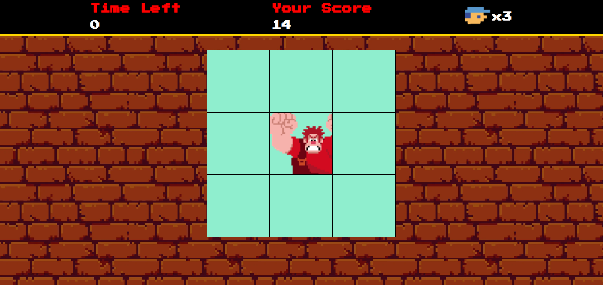

# Detona Ralph Game  

Bem vindo ao **Detona Ralph Game**! Este é um jogo baseado no famoso filme "Detona Ralph". Trata-se de um jogo de Click Speed, no qual você será desafiado a clicar o mais rápido possível nos quadrados onde o Ralph aparecer para somar a maior quantidade de pontos antes que o tempo de jogo acabe. 
Este projeto não apenas oferece entretenimento, mas também demonstra várias técnicas avançadas de desenvolvimento de jogos em JavaScript.

   

### ⚙ Tecnologias Utilizadas

- HTML5 e CSS3 para a estrutura e aparência do jogo.
- JavaScript para a lógica de programação e interatividade.
- Sprites e imagens customizadas para criar a estética única do universo de Detona Ralph.

### ✔️ Funcionalidades Incríveis

- **Sistema de Pontuação**: Clique no quadrado que o Ralph se encontra e acompanhe sua pontuação à medida que progride no jogo. Desafie seus amigos a superá-lo!
- **Jogue em qualquer tela**: Além do que foi sugerido previamente no projeto, foi adicionada a **responsividade** ao jogo, o que significa que ele está apto para ser jogado em qualquer tipo de tela, seja PCs, Notebooks, Tablets, Smartphones, entre outros!

### 🕹️ Como Jogar ?

1. Clone este repositório para sua máquina local.
2. Abra o arquivo `index.html` em seu navegador web.
3. Divirta-se jogando!
5. Ou, [Clique aqui](https://mari4souza.github.io/detona-ralph-game/).

### 🤝🏻 Contribuição

Contribuições são bem-vindas! Se você deseja melhorar este jogo, adicionar novos recursos ou corrigir problemas, sinta-se à vontade para abrir um _pull request_.

### 📝 Créditos

Este jogo foi desenvolvido como parte de um projeto educacional da Digital Innovation One.
